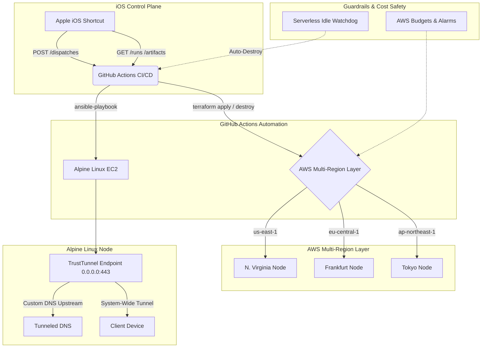

# Automated Disposable TrustTunnel VPN Infrastructure

This repository contains a complete, production-grade Infrastructure as Code (IaC) solution for deploying an automated, single-node, disposable VPN system using TrustTunnel on Alpine Linux. The entire lifecycle is managed via Terraform, Ansible, GitHub Actions, and an ultra-lightweight native Apple iOS Shortcut Control Plane.

## 🌟 System Architecture



### Core Design Principles
1. **Single Active Node**: Only ONE EC2 VPN instance exists at any given time. When you select a new region via the iOS Shortcut, Terraform automatically updates desired state, destroying the old region's instance and provisioning the new one within a single `terraform apply` run.
2. **Extreme Cost Efficiency (Free Tier Aligned)**: Constrained to a single free-tier eligible micro instance (`t4g.micro` arm64 or `t3.micro` x86_64) and an 8GB gp3 EBS volume. No NAT Gateways or Load Balancers are used.
3. **Automated Teardown & Idle Safety**: Equipped with an auto-destroy idle watchdog and CloudWatch billing alarms to ensure monthly compute hours never accumulate unexpectedly.
4. **TrustTunnel on Alpine Linux**: Utilizes Alpine Linux for lightning-fast boot times and minimal resource overhead. TrustTunnel operates in system-wide tunnel mode listening on `0.0.0.0:443` with custom DNS upstream routing to prevent DNS leaks.

---

## 📂 Repository Structure

```text
├── .github/
│   └── workflows/
│       ├── deploy-region.yml        # CI/CD Workflow to deploy/switch VPN regions
│       └── destroy-active.yml       # CI/CD Workflow to teardown active infrastructure
├── terraform/
│   ├── main.tf                      # Root module instantiating active regional node
│   ├── variables.tf                 # Root variables (active_region, instance_type, etc.)
│   ├── providers.tf                 # Multi-region AWS provider aliases (us-east-1, eu-central-1, ap-northeast-1)
│   ├── backend.tf                   # Remote S3 backend configuration with DynamoDB locking
│   ├── outputs.tf                   # Consolidated active node outputs (Public IP, Instance ID)
│   ├── billing_alerts.tf            # AWS Budgets and CloudWatch billing alarms
│   └── modules/vpn_node/            # Regional child module (VPC, Subnet, SG, IAM, EC2)
├── ansible/
│   ├── ansible.cfg                  # Ansible configuration (host key checking disabled)
│   ├── inventory.yml                # Template dynamic inventory
│   ├── playbook.yml                 # Master provisioning playbook
│   └── roles/trusttunnel/           # Role to configure Alpine, iptables NAT, and TrustTunnel
├── control-plane-ios-shortcut/
│   ├── README.md                    # Step-by-step visual Apple Shortcut creation guide
│   ├── generate_shortcut_definition.py # Python script generating exact Apple Shortcut JSON blueprint
│   └── TrustTunnel_Control_Plane.shortcut.json # Pre-compiled Apple Shortcut importable structure
├── control-plane-api/
│   └── idle_watchdog.py             # Serverless AWS Lambda watchdog for automated idle teardown
└── scripts/
    ├── mock_trusttunnel.py          # Fully functional Python mock TrustTunnel daemon & client generator
    └── check_free_tier_usage.py     # Standalone audit script for AWS Free Tier compliance
```

---

## 🚀 Getting Started

### 1. Prerequisites & GitHub Secrets
Before deploying, ensure you have configured the following encrypted repository secrets in your GitHub repository (`Settings > Secrets and variables > Actions`):

| Secret Name | Description |
| :--- | :--- |
| `AWS_ACCESS_KEY_ID` | AWS IAM User Access Key with permissions to manage EC2, VPC, IAM, and S3. |
| `AWS_SECRET_ACCESS_KEY` | AWS IAM User Secret Access Key. |
| `SSH_PRIVATE_KEY` | Private SSH key matching the public key deployed to your EC2 instances (or rely on automated key pairs). |

### 2. Terraform S3 Backend Configuration
Update `terraform/backend.tf` with your existing AWS S3 bucket name and DynamoDB table name for remote state locking:
```hcl
terraform {
  backend "s3" {
    bucket         = "my-terraform-state-bucket"
    key            = "trusttunnel-vpn/terraform.tfstate"
    region         = "us-east-1"
    dynamodb_table = "terraform-state-locks"
  }
}
```

---

## 📱 iOS Shortcut Control Plane Setup

The Control Plane is an ultra-lightweight, native Apple iOS Shortcut that communicates directly with the GitHub Actions REST API. You can trigger deploys, switch regions, poll progress, and import your VPN client configuration profile directly from your iPhone, iPad, or Mac.

### Quick Setup Instructions
1. Open the `control-plane-ios-shortcut/README.md` guide for full visual instructions.
2. Generate or inspect the complete Shortcut structure by running:
   ```bash
   python control-plane-ios-shortcut/generate_shortcut_definition.py
   ```
3. Open the Apple Shortcuts app on your iOS device or Mac, create a new Shortcut, and add the following core actions:
   - **Menu**: Add options for `us-east-1`, `eu-central-1`, `ap-northeast-1`, `Destroy VPN`, and `Check Status`.
   - **URL & Network**: Use `Get Contents of URL` to make `POST` requests to `https://api.github.com/repos/<OWNER>/<REPO>/actions/workflows/deploy-region.yml/dispatches` with your GitHub Personal Access Token (PAT) in the `Authorization: Bearer <PAT>` header.
   - **Artifact Extraction**: Use `Get Contents of URL` to download the completed workflow's `client-config` zip artifact, followed by the `Extract Archive` and `Share` actions to pass `client.conf` directly to your WireGuard, OpenVPN, or TrustTunnel iOS app.

---

## 🛡️ Free Tier Guardrails & Cost Safety

AWS recommends tracking EC2 instance and EBS usage closely to avoid surprise charges. This project incorporates multiple automated safety nets:
- **Single Instance Constraint**: Terraform logic ensures `count = 1` only for the active region, forcing automated destruction of any previous node during region switches.
- **AWS Budgets & CloudWatch Alarms**: Automatically provisions a zero-spend/low-spend budget and billing alarm (`billing_alerts.tf`).
- **Serverless Idle Watchdog**: The `control-plane-api/idle_watchdog.py` script can be deployed as an AWS Lambda function or scheduled cron job. It monitors EC2 `NetworkOut` metrics and automatically dispatches the `destroy-active.yml` workflow if the VPN remains idle for a configurable threshold.
- **Standalone Audit Utility**: Run `python scripts/check_free_tier_usage.py` at any time to verify your account's monthly accumulated micro-instance hours and EBS volume consumption.

---

## 🔒 Security Model & Tunnel DNS

- **Zero Plaintext Secrets**: Terraform state is encrypted at rest in S3. Client credentials and private keys are generated dynamically on the isolated Alpine Linux instance during Ansible provisioning and securely fetched as ephemeral workflow artifacts.
- **Tunneled DNS**: TrustTunnel client profiles are explicitly configured with custom DNS upstreams (e.g., `1.1.1.1` or `8.8.8.8`). All client DNS queries are forced through the encrypted tunnel interface (`tun0`), eliminating DNS leaks.
- **SSM Hardening**: Instances are provisioned with AWS Systems Manager (SSM) Session Manager IAM profiles (`AmazonSSMManagedInstanceCore`), allowing secure, bastionless terminal access without exposing public SSH ports if desired.
