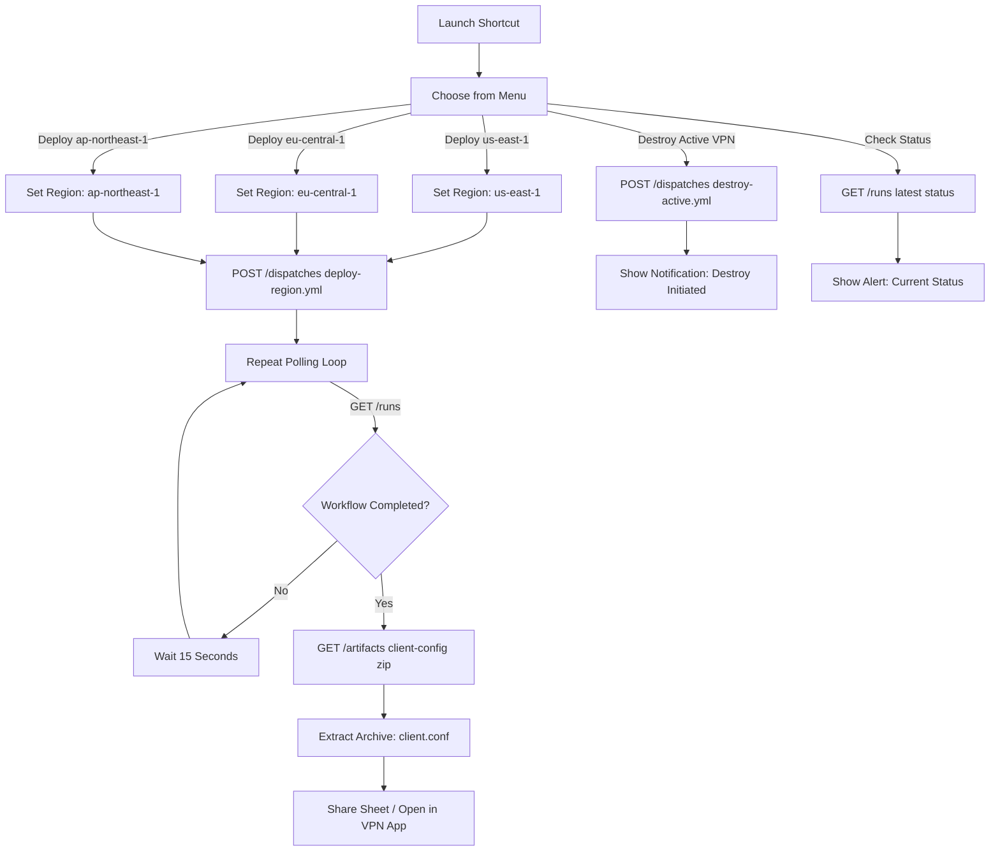

# Apple iOS Shortcut Control Plane Guide

The TrustTunnel Control Plane is an elegant, ultra-lightweight native Apple iOS Shortcut. It allows you to trigger VPN deployments, switch active AWS regions, poll workflow execution status, and import your generated VPN client configuration profile directly from your iPhone, iPad, or Mac.

---

## 📱 Shortcut Architecture & Action Flow



---

## 🛠️ Step-by-Step Construction Guide

You can easily build this Shortcut directly in the Apple Shortcuts app on your iOS device or Mac in about 5 minutes.

### Step 1: Define Configuration Variables
At the very top of your Shortcut, add a **Text** action to store your GitHub Personal Access Token (PAT) and Repository details:
- **Text**: `<YOUR_GITHUB_PAT_HERE>` (Rename variable to `GitHubToken`)
- **Text**: `https://api.github.com/repos/<OWNER>/<REPO>` (Rename variable to `GitHubApiBase`)

### Step 2: Create Main Menu
Add a **Choose from Menu** action with the following prompt: *"Select TrustTunnel VPN Action"*
- Option 1: `Deploy N. Virginia (us-east-1)`
- Option 2: `Deploy Frankfurt (eu-central-1)`
- Option 3: `Deploy Tokyo (ap-northeast-1)`
- Option 4: `Destroy Active VPN`
- Option 5: `Check Status`

### Step 3: Configure Region Deploy Actions
Under each Deploy menu option, add a **Set Variable** action named `SelectedRegion` with the respective region code (`us-east-1`, `eu-central-1`, or `ap-northeast-1`).

Below the menu block, add the **Get Contents of URL** action to trigger the GitHub Actions workflow dispatch:
- **URL**: `GitHubApiBase`/actions/workflows/deploy-region.yml/dispatches
- **Method**: `POST`
- **Headers**:
  - `Authorization`: `Bearer GitHubToken`
  - `Accept`: `application/vnd.github+json`
  - `X-GitHub-Api-Version`: `2022-11-28`
- **Request Body (JSON)**:
  ```json
  {
    "ref": "main",
    "inputs": {
      "region": "SelectedRegion"
    }
  }
  ```

### Step 4: Implement Polling Loop
Add a **Repeat** action set to repeat `20` times. Inside the repeat loop:
1. Add **Wait** action set to `15` seconds.
2. Add **Get Contents of URL**:
   - **URL**: `GitHubApiBase`/actions/runs?per_page=1
   - **Method**: `GET`
   - **Headers**: Same Authorization and Accept headers as above.
3. Add **Get Dictionary Value** to parse `workflow_runs.1.status` and `workflow_runs.1.conclusion`.
4. Add an **If** condition: If `status` is `completed` and `conclusion` is `success`, use the **Stop Shortcut** or **Break** logic to exit the repeat loop and proceed to artifact extraction.

### Step 5: Download & Extract Client Profile
After the repeat loop finishes successfully:
1. Add **Get Contents of URL** to fetch the artifact metadata: `GitHubApiBase`/actions/runs/<RUN_ID>/artifacts
2. Parse the dictionary to get the `archive_download_url` for the artifact named `client-config`.
3. Add **Get Contents of URL** pointing to the `archive_download_url` (ensure Authorization header is included).
4. Add **Extract Archive** action to extract `client.conf`.
5. Add **Share** action passing the extracted `client.conf` file. Tapping this will pop up the iOS Share Sheet, allowing you to instantly import the profile into your WireGuard, OpenVPN, or TrustTunnel iOS app!

---

## 🤖 Automated Blueprint Generator

If you wish to inspect the exact, fully structured JSON representation of these Shortcut actions, run the included Python generator script:
```bash
python control-plane-ios-shortcut/generate_shortcut_definition.py
```
This outputs `TrustTunnel_Control_Plane.shortcut.json`, serving as an executable blueprint and documentation reference.
